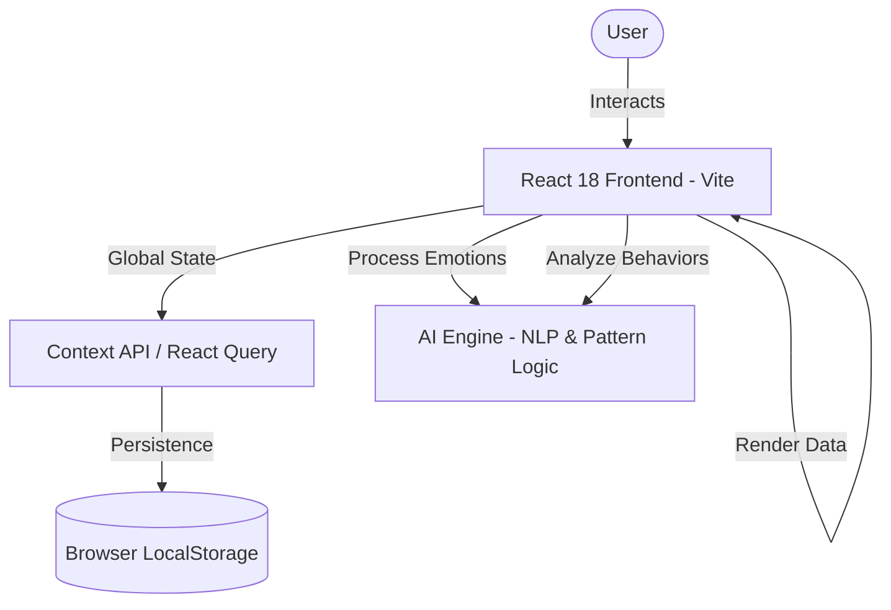

# 💜 HeartHeaven 🕊️
> **Translate Emotions. Heal Minds. Find Clarity.**


---

## 🚩 Problem Statement

In the modern era, while we are more "connected" than ever through technology, the quality of our interpersonal communication is declining. High-stress environments, digital distractions, and a lack of formal emotional intelligence training lead to several critical issues in relationships:

1. **The "Blame Trap"**: When conflicts arise, individuals often resort to "You" statements (*"You always do this..."*), which triggers defensiveness rather than resolution.
2. **Emotional Illiteracy**: Many people struggle to identify precisely what they are feeling (Anger? Insecurity? Grief?), making it impossible to communicate needs effectively.
3. **The Silent Erosion**: Toxic behavioral patterns ("Red Flags") often go unrecognized until they have caused significant psychological harm. Conversely, positive behaviors ("Green Flags") are rarely tracked or celebrated, leading to a lack of positive reinforcement.
4. **Crisis Vacuum**: Most relationship therapy is expensive and requires weeks of waiting. There is no immediate "first-aid" tool for when an argument is happening *right now*.

---

## 💡 The HeartHeaven Solution

HeartHeaven is an AI-powered emotional intelligence platform that acts as a **24/7 digital mediator**. It doesn't just "chat"; it provides a structured toolkit to de-escalate conflict and build empathy using scientifically-backed communication methods.

### How it solves the crisis:
- **Instant De-escalation**: By using the **Emotional Translator**, users can convert raw anger into "I-statements" that focus on vulnerability rather than blame.
- **Pattern Recognition**: The **Flag Detector** provides an objective library of behaviors, helping users remove "emotional fog" and see their situation clearly based on defined psychological markers.
- **Physiological Calming**: The **Safe Space** integrates box-breathing exercises to lower cortisol levels before a user engages in a difficult conversation.
- **Data-Driven Growth**: The **Relationship Dashboard** turns abstract feelings into trackable metrics, allowing users to see progress over time.

---

## 🚀 Key Features

### 🔄 Emotional Translator
The heart of HeartHeaven. It uses Natural Language Processing (NLP) to analyze the sentiment of a sentence and suggests a "Compassionate Alternative."
*   *Input:* "You never listen to me and you're always on your phone!"
*   *HeartHeaven Translation:* "I feel unheard and a bit lonely when we spend time together but don't talk. Can we set some phone-free time?"

### 🚩 Flag Detector (Red & Green)
A comprehensive diagnostic tool.
*   **Red Flags:** Learn to identify gaslighting, isolation, and lack of accountability.
*   **Green Flags:** Track reliability, emotional safety, and healthy boundaries.
*   **Checklist Mode:** A personal tracker to monitor which behaviors are present in a relationship.

### 🧘 The Safe Space
A refuge for when things get too heated.
*   **Venting Mode:** A non-judgmental "digital journal" to dump raw emotions.
*   **Perspective Engine:** AI provides a neutral, third-party view of a conflict to help reduce bias.
*   **Calm Mode:** Guided box-breathing animations to stabilize the nervous system.

### 📈 Relationship Dashboard
A high-level view of your emotional journey.
*   **Health Score:** A dynamic metric calculated based on flag discovery and emotional check-ins.
*   **Conflict History:** Visualize the frequency of arguments to identify seasonal or situational triggers.
*   **AI Insights:** Personalized tips based on your recent activity.

---

## 📐 Architecture Diagram



---

## 🛠️ Tech Stack

### Frontend Core
- **React 18**: High-performance UI library.
- **TypeScript**: Ensuring reliable handling of sensitive user data.
- **Vite**: Ultra-fast build tool.
- **React Router DOM**: Declarative routing.

### Styling & UI
- **Tailwind CSS**: Utility-first CSS for premium design.
- **Shadcn UI**: Accessible components built on Radix UI.
- **Framer Motion**: Advanced physics-based animations.
- **Lucide React**: consistent icons.

### Data & Logic
- **Recharts**: Data visualization.
- **React Hook Form + Zod**: Schema-first form validation.
- **TanStack Query (v5)**: State management.
- **LocalStorage API**: Client-side persistence.

---

## 🤖 AI Tools Used

| Tool | Purpose |
| :--- | :--- |
| **Antigravity** | Lead Agentic AI for architecture, code refactoring, and multi-file orchestration. |
| **Gemini 2.0 Flash** | Core logic generation for communication algorithms and NLP logic. |
| **V0 / Shadcn UI** | Accelerated implementation of premium UI components. |

---

## 💻 Source Code Structure
- `src/components/ui/`: Atomic UI components.
- `src/contexts/`: Global state (Auth, Language).
- `src/hooks/`: Business logic (Stats, Analysis).
- `src/pages/`: Main features.
- `src/lib/`: Custom utilities.

---

## ⚡ Setup & Build

### Prerequisites
- **Node.js** (v18+)
- **npm** or **bun**

### Commands
```bash
npm install     # Install dependencies
npm run dev     # Start development server
npm run build   # Build for production
npm run preview # Preview production build
```

---

## 🎬 Final Output
### 🌐 Live Demo
[View Live Project on Vercel](https://heart-sync-weld.vercel.app/)

## 🤝 Team BYTE BUSTERS
- **Saswat Dutta** - Full Stack Developer
- **Jaiman M Vaidya** - Full Stack Developer
- **Prabhakar Shukla** - Database Engineer
- **Aditya Kumar** - Frontend Developer
- **Dharitri Padhi** - Idea Innovator

---

## 📄 License
MIT License - Open Source for healthy connections.
