# 💜 HeartHeaven 🕊️
> **Translate Emotions. Heal Minds. Find Clarity.**

<div align="center">


</div>

---

## 🚩 Problem Statement

In the modern era, while we are more "connected" than ever through technology, the quality of our interpersonal communication is declining. High-stress environments, digital distractions, and a lack of formal emotional intelligence training lead to several critical issues in relationships:

1. **The "Blame Trap"**: When conflicts arise, individuals often resort to "You" statements (*"You always do this..."*), which triggers defensiveness rather than resolution.
2. **Emotional Illiteracy**: Many people struggle to identify precisely what they are feeling (Anger? Insecurity? Grief?), making it impossible to communicate needs effectively.
3. **The Silent Erosion**: Toxic behavioral patterns ("Red Flags") often go unrecognized until they have caused significant psychological harm. Conversely, positive behaviors ("Green Flags") are rarely tracked or celebrated, leading to a lack of positive reinforcement.
4. **Crisis Vacuum**: Most relationship therapy is expensive and requires weeks of waiting. There is no immediate "first-aid" tool for when an argument is happening *right now*.

---

## 💡 The HeartHeaven Solution

HeartHeaven is an AI-powered emotional intelligence platform that acts as a **24/7 digital mediator**. It doesn't just "chat"; it provides a structured toolkit to de-escalate conflict and build empathy using scientifically-backed communication methods.

### How it solves the crisis:
- **Instant De-escalation**: By using the **Emotional Translator**, users can convert raw anger into "I-statements" that focus on vulnerability rather than blame.
- **Pattern Recognition**: The **Flag Detector** provides an objective library of behaviors, helping users remove "emotional fog" and see their situation clearly based on defined psychological markers.
- **Physiological Calming**: The **Safe Space** integrates box-breathing exercises to lower cortisol levels before a user engages in a difficult conversation.
- **Data-Driven Growth**: The **Relationship Dashboard** turns abstract feelings into trackable metrics, allowing users to see progress over time.

---

## 🚀 Key Features

### 🔄 Emotional Translator
The heart of HeartHeaven. It uses Natural Language Processing (NLP) to analyze the sentiment of a sentence and suggests a "Compassionate Alternative."
*   *Input:* "You never listen to me and you're always on your phone!"
*   *HeartHeaven Translation:* "I feel unheard and a bit lonely when we spend time together but don't talk. Can we set some phone-free time?"

### 🚩 Flag Detector (Red & Green)
A comprehensive diagnostic tool.
*   **Red Flags:** Learn to identify gaslighting, isolation, and lack of accountability.
*   **Green Flags:** Track reliability, emotional safety, and healthy boundaries.
*   **Checklist Mode:** A personal tracker to monitor which behaviors are present in a relationship.

### 🧘 The Safe Space
A refuge for when things get too heated.
*   **Venting Mode:** A non-judgmental "digital journal" to dump raw emotions.
*   **Perspective Engine:** AI provides a neutral, third-party view of a conflict to help reduce bias.
*   **Calm Mode:** Guided box-breathing animations to stabilize the nervous system.

### 📈 Relationship Dashboard
A high-level view of your emotional journey.
*   **Health Score:** A dynamic metric calculated based on flag discovery and emotional check-ins.
*   **Conflict History:** Visualize the frequency of arguments to identify seasonal or situational triggers.
*   **AI Insights:** Personalized tips based on your recent activity.

---

## 📐 Architecture Diagram (MERN Stack)

```mermaid
graph TB
    %% Nodes
    User((👤 User))

    subgraph Client_Layer ["💻 CLIENT SIDE (React.js)"]
        UI[Vite + React 18 UI]
        State[React Context / TanStack Query]
        Framer[Framer Motion Animations]
    end

    subgraph Server_Layer ["⚙️ SERVER SIDE (Node.js)"]
        Express[Express.js Framework]
        API[RESTful API Gateway]
        AI_Logic[AI Pattern Logic & NLP]
    end

    subgraph Data_Layer ["🗄️ DATA STORAGE"]
        DB[(MongoDB Atlas)]
        Storage[(Local Storage - Cache)]
    end

    %% Connections
    User <--> |Interacts with| UI
    UI <--> |Data Flow| State
    State <--> |API Calls| API
    API <--> |Routing| Express
    Express <--> |Process Intelligence| AI_Logic
    AI_Logic <--> |Query/Update| DB
    State -.-> |Persist State| Storage

    %% Styling
    style User fill:#fff7ed,stroke:#f97316,stroke-width:2px
    style Client_Layer fill:#f5f3ff,stroke:#8b5cf6,stroke-width:2px,color:#4c1d95
    style Server_Layer fill:#eff6ff,stroke:#3b82f6,stroke-width:2px,color:#1e3a8a
    style Data_Layer fill:#ecfdf5,stroke:#10b981,stroke-width:2px,color:#064e3b
    style UI fill:#fff,stroke:#8b5cf6
    style Express fill:#fff,stroke:#3b82f6
    style DB fill:#fff,stroke:#10b981
```



---

## 🛠️ Tech Stack

### 📱 Frontend (React Ecosystem)
- **React 18**: High-performance UI library for component-based architecture.
- **TypeScript**: Type-safe development for complex emotional data handling.
- **Vite**: Modern frontend tooling for lightning-fast HMR and builds.
- **Tailwind CSS & Shadcn UI**: Professional design system with utility-first styling.
- **Framer Motion**: Smooth, physics-based micro-interactions and animations.

### ⚙️ Backend & AI (Node/Express)
- **Node.js**: Asynchronous event-driven JavaScript runtime.
- **Express.js**: Minimalist web framework for building robust REST APIs.
- **AI Core**: Custom NLP algorithms for sentiment analysis and empathy mapping.

### 🗄️ Persistence & Data
- **MongoDB Atlas**: Scalable NoSQL database for relationship tracking and history.
- **TanStack Query (v5)**: Powerful asynchronous state management and caching.
- **Zod**: Schema-first validation for data integrity.

---

## 🤖 AI Tools Used

| Tool | Purpose |
| :--- | :--- |
| **Antigravity** | Lead Agentic AI for architecture, code refactoring, and multi-file orchestration. |
| **Gemini 2.0 Flash** | Core logic generation for communication algorithms and NLP logic. |
| **V0 / Shadcn UI** | Accelerated implementation of premium UI components. |

---

## 💻 Source Code Structure
- `src/components/ui/`: Atomic UI components.
- `src/contexts/`: Global state (Auth, Language).
- `src/hooks/`: Business logic (Stats, Analysis).
- `src/pages/`: Main features.
- `src/lib/`: Custom utilities.

---

## ⚡ Setup & Build

### Prerequisites
- **Node.js** (v18+)
- **npm** or **bun**

### Commands
```bash
npm install     # Install dependencies
npm run dev     # Start development server
npm run build   # Build for production
npm run preview # Preview production build
```

---

## 🎬 Final Output
### 🌐 Live Demo
[View Live Project on Vercel](https://heart-heaven-ai-relationship-mediat.vercel.app/)

## 🤝 Team BYTE BUSTERS
- **Saswat Dutta** - Full Stack Developer
- **Jaiman M Vaidya** - Full Stack Developer
- **Prabhakar Shukla** - Database Engineer
- **Aditya Kumar** - Frontend Developer
- **Dharitri Padhi** - Idea Innovator

---

## 📄 License
MIT License - Open Source for healthy connections.
